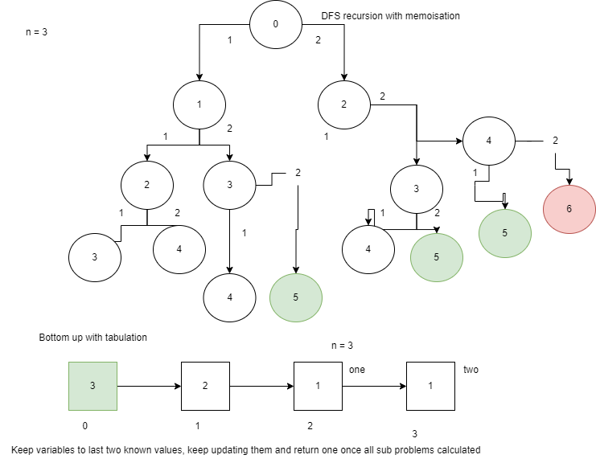

<p align="center">
<h1> coding-patterns to help as an aide-memoire </h1>
</p>

<p>
    The idea behind this manual with accompanying code samples is to try to distill the most used algorithms and data structures that are required for coding interviews and well getting a job. But also more so that the study of algorithms and DSs should not end once one has a job, as they are really fun to play with, and they can lead to all sorts of fun places with advanced data structures and algorithms, whilst sometimes esoteric should also help you as a developer broaden your understanding and deepen your knowledge of this wonderful place called "computer land".
    
</p>


## Online tools to practice for technical interviews

* [Structy](https://structy.net/) This site offers a online playground along with course videos and explanations for practicing data structures and algorithms
* [TS Playground](https://www.typescriptlang.org/play?#code/Q) This is a good option for a technical interview if you have to code a solution to a problem using typescript.
* [Geeks for Geeks] (https://practice.geeksforgeeks.org/)
* [Interview Cake](https://www.interviewcake.com/)
* [Leet code](https://leetcode.com/)
* [Neet code](https://www.youtube.com/channel/UC_mYaQAE6-71rjSN6CeCA-g) A youtube channel from a a guy who is now a Google engineer who created videos in python of many Leet code challenges
* [Algo.monster](https://algo.monster/) A site which distills essential algorithms, data structures and techniques for interviewing. Created by former Google engineers.
* [Replit](https://replit.com/) A online IDE with some awesome capabilities and powerful online compiling and interpreting capabilities. Good for testing projects, proof of concept etc.

------------

### Great Courses that teach Algorithms and DS 

Theprimeagen FEM
Neetcode site has a course
Stephen Grider course

# General Programming concepts:
Be able to define, describe and demonstrate through examples the following concepts:

1. Closure 
2. Partially applied function
3. Currying
4. Higher Order Functions
5. Event loop

Will Sentance has a great course on this on the [Frontend Masters platform](https://frontendmasters.com/teachers/will-sentance/)
   

## Javascript built-in functions and utilities to help solve coding challenges

#### Sorting numbers in javascript
```javascript
  let numArray: number[] = [1400, 9, 80, 45];

  const sorted = numArray.sort((a, b) => a - b);

```

#### Check for presence of an array.
Because there is no native support for checking if an array exists you can use the two checks:
```javascript
let isArray = []
typeof isArray === "object" && "length" in isArray // length is native in Array but not in Objects
```
A more robust way to check for an array is the following code:
```javascript
const isArray = value => {
	return typeof value.reduce == "function" &&
	       typeof value.filter == "function" &&
               typeof value.map == "function" &&
               typeof value.length == "number";
}
```
#### Math problems and manipulating numbers

---

The ability to iterate through digits comes up from time to time. One effective way in python is to do the following.

```python

    num = 12345
    lastidigit = num % 10 # 5
    firstMinusLast = int(num / 10) # 1234

```
This comes up in the *Happy Numbers* [click here](https://leetcode.com/problems/happy-number/?envType=study-plan&id=level-2) problem which is also solved using a slow and fast pointer, the number is slow, and the next calculation is fast. If the two meet then you have a problem (cycle), otherwise they converge on 1 which is solution.

---

<details>
<summary>[Product of Array except self]([https://](https://leetcode.com/problems/product-of-array-except-self/))</summary>

---

- The easy way would be to get the product of the entire array and then divide each number at the index to get value. As division is not allowed there is a less intuitive way.
- It involves to passes of the array, O(n), prefix, and postfix totals are calcualated one by one as you iterate the list.
- The output can be obtained by multiplying the prefix value, to the left of idx and the postfix to the right of idx.
- The solution can also be done in memory O(1) as postfix and prefix can be calculated on the fly


---
</details>

----
#### prefix and postfix pattern

This is a pattern that is likely to come up often with coding interviews. The below implementation of a data structure that deals with, or utilises this pattern, where one can easily calculate prefix or postfix sums from previously calculated sub problems makes implementing solutions of this type operate in O(1) time as oppose to the brute force O(n) runtime complexity.

```python

class PrefixSum:

  def __init__(self, nums):
    self.prefix = []
    total = 0
    for n in nums:
      total += n
      self.prefix.append(total)
  
  def rangequery(self, l, r):
    preRight = self.prefix[r]
    preLeft = self.prefix[l - 1] if l > 0 else 0
    return preRight - preLeft


```
----

---
## Prime numbers (Primality)

The following is a reasonable way to compute prime numbers,

```python
	primes = set()
	for a in range(2, 999):
		if all(a % p != 0 for p in primes):
			primes.add(a)
```
There are a number of rules for prime numbers:
1. A prime number has only two divisors, 1 and itself
2. Checking prime numbers before (or less than the current number) will always result in a good check to see if it divides the number. If it does then it can't be a prime
3. Every composite number can be factored down to a product of primes

#### isPrime problem 

- use the fact that sqrt of a number will give you all the possible pairs to lead that to a factor.
- Often convert a number after sqrt, to floor, to get a rounded down integer
- Use the modulo oerator to see if it is a factor.
- EDGE CASE: 1 is not a prime number.

```python
for i in range(2, floor(sqrt(n)))):
	if n % i == 0
```
---
#### Serializing and deserializing an Array

``` 
  PSEUDO CODE:
    - to serialise: 
        - create a result array, 
        - recursively call a dfs function, passing the next node in, and a reference to the result array to be populated inside recursive call.
        - return array as joined " ";
        Normally in the recursive call you think about the return value, and what state, in this case we only worry about the state, which is array passed in as reference.
        - base case is leaf node, if (!node) push 'x' to array and return void.
        - push the node.val and then 
        - recursively call function passing the left and right nodes in calls respectively, along with state.
    - to deserialise:
        - Use the trick of creating an iterator from the string split as array, the arr[Symbol.iterator]() will do it 
        - pass this in as the only argument to dfs function for deserialising,
        - inside the function first get the next value by calling iterator.next(),
        - if it is an 'x' char then simply return void, as its a leaf node, // base case to get out of recursion
        - otherwise create a new Node, passing parseInt(value, 10)
        - then with that node call left and right recursive calls passing result back to curr.left or curr right.
        - then return the current node, which goes back into recursive call.
```

```javascript
    function serialize(root) {
        const res = [];
        dfs_serialize(root, res);
        return res.join(" ");
    }

    const dfs_serialize = (node, res) => {
    if (!node) {
        res.push("x");
        return;
    }
    res.push(node.val)
    dfs_serialize(node.left, res)  
    dfs_serialize(node.right, res)
    }

    function deserialize(s) {
        return dfs_deserialize(s.split(" ")[Symbol.iterator]())
    }

    const dfs_deserialize = (nodes) => {
        const {value} = nodes.next();
        if (value === "x") return;
        const newNode = new Node(parseInt(value, 10))
        newNode.left = dfs_deserialize(nodes)
        newNode.right = dfs_deserialize(nodes)
        return newNode;
    };
```
---------

## General Patterns to start solving a problem

* Start with Brute Force approach, even if you know it is not efficient it will lead to other considerations to solve the problem
* Keep track of the best answer so far in one pass of the problem, see if you can break it down into pieces
* Consider early to use a hash map, even if you don't know how yet as it is used in solving many problems generally.
    - If your brute force solution results in a nested __for loop__ this should indicate you can almost certainly use a hashmap O(1) lookup to reduce the complexity from O(n^2) to O(n). Use the ```if (num in hash)``` check 

### Calculating complexity

<details><summary>Describe Big O (three points): </summary>

  * growth is with respect to the input
  * Constants are dropped
  * Worst case is expected in interview settings
  
</details>

---

- Terms that can be used to describe complexity include: 
    * Constant time O(1) - time does not increase in proportion to input, independant
    * Maximal efficient solution
    * linear complexity O(n) - direct relation
    * Quadratic complexity O(2^n) or exponential 
    * Multi-linear comlpexity O(n+m), this would be the case where two __for loops__ follow each other.

------------

## Specific patterns to solving a problem


### Python tips and tricks commonly used

<details>
<summary>generate an empty multidimensional array using a list comprehension of size n</summary>

---
```python
    freq = [[] for n in range(len(n) + 1)]
```
---

</details>

<details>
<summary>update an item in a dict, and add a first entry if it is not present</summary>

---
```python
    dict[n] = 1 + dict.get(n, 0)
```
---
</details>

---
Be aware of immutable updates to a string variable in a for loop. Rather use a List which is mutable and later pass back a string.


---
-------------------
* Identify the base case
```python
   # here you also agree what the return value will be, and it needs to be consistent across all recursive calls
   if len(nums) == 0:
      return 0
```
* Make your recursive calls. Determine the part that reduces input to get to base case. Like a binary decision process in the non-adjacent-sum problem.
Either include a value in your sum, or exclude a value in your sum
```python
  # python slicing syntax. Take from index up until end of list
  include = nums[0] + non_adjacent_sum(nums[2:])
  exclude = non+adjacent_sum(1:)
  # built in max function to get max of the branch
  return max(include, exclude)
```
* Now you have your brute force approach. get this working first, so your core logic is in place
* Add memoisation, and deal with any edge cases and optimisations, such as getting rid of slices

```python
  # get rid of slice calls in recursion. bake in an extra argument called i
  def _non_adjacent_sum(nums, 0):
      # change base case to deal with index increasing
      if i >= len(nums):
         return 0
      # deal with recursion on index and not slicing array each time
      include = nums[0] + _non_adjacent_sum(nums, i + 2) # avoid the adjacent value
      exclude ....
```
* finally build in classic memoisation, using the changing value, i as index in dictionary

The complexity of this approach would be O(n) time and O(n) space. Both linear time.

Usually to calcualte the complexity you first drwa out the state-space decision tree and then you can see how many decisions you have to make, this will be your coefficient. and then the height of the tree would be your factor. 

To take an example to demonstrate this as well as the alternative approach of **Bottom UP** or **Tabulation** the below [Climbing Stairs](https://leetcode.com/problems/climbing-stairs/) problem has been used. The Bottom up approach can result also in O(n) runtime but using two vars to keep track of previous sub-problems that were calculated you can reduce the space complexity to O(1), constant time.


  

The below is the DFS recursive with memoisation solution Time: O(n) Space: O(n)
```python
def _climbStairs(n, memo):
    
    if n in memo:
        return memo[n]
    
    if n < 0:
        return 0
    
    if n == 0:
        return 1
    
    memo[n] = _climbStairs(n - 1, memo) + _climbStairs(n - 2, memo)
    return memo[n]
    
class Solution:
    def climbStairs(self, n: int) -> int:
        return _climbStairs(n, {})
```
The below is the bottom-up Time: O(n) Space: O(1)

```python
class Solution:
    def climbStairs(self, n: int) -> int:
        one = 1
        two = 1
        for i in range(n - 1):
            one, two = one + two, one
        return one
        
```
TODO ADD MIN COST CLIMBING STAIRS STEPS

<details>
<summary>Describe pseudo steps to solve min cost problem?</summary>

  + This is solved using a bottom up, DP solution
  + It result in O(n) time and O(1) space
  + Start at third to last item in list, and iterate backwards until -1
  + keep adding the min amount and step once or step twice
  + finally return the minimum of first or second value

#### Python code
```python
    class Solution:
      def minCostClimbingStairs(self, cost: List[int]) -> int:
        cost.append(0)
        
        for i in range(len(cost) - 3, -1, -1):
            cost[i] += min(cost[i + 1], cost[i + 2])
        return min(cost[i], cost[i + 1])
 

```
</details>

## Algorithms to know

### Max value logic implementation

* It is a common strategy to add max or min value logic into recursive solutions to problems
```python
   float("-inf") # for default max value logic, use positive infitity to default for min value
   # then use builtin max or min function to test max / min value from each branch
   max(left, right) # this left and right comes from your recursive calls
```

In javascript it is similar but different syntax
```javascript
  Math.max(left, right)
  Math.min(left, right)
  // and use the defualt Inifinity or -Inifinity
  Inifinity || -Inifinity
```


### Two pointers
* A common strategy for keeping track in array and string based problems
* Two pointers can be used to track slices of a string, the below snippet highlights a use case

```javascript
            const uncompress = (s) => {
            
            let left = 0;
            let right = 0;
            const output = [];
            
            const isNumber = new RegExp(/\d/)
            
            for (let i = 0; i < s.length; i++) {
                if (isNumber.test(s[i])) {
                    right += 1;
                    continue;
                }
                const times = s.slice(left, right);
                output.push(s[i].repeat(times));
                left = right + 1;
                right = left;
            }
            
            
            
            return output.join('')
            };


            uncompress("2c3a1t");
```

Two pointers come in a number of forms:
    - same direction (used for Remove duplicates), or fast, slow pointers.
    - opposite direction (used for Two sum sorted)
    - sliding window (used for Longest substring without repeating characters)
    - Prefix sum 

The key to using two pointers pattern in a two sum type problem is knowing the porerties of the sorted array. It is such that by setting the L and R bounds on the boundaries, you can work on the fact that if the sum of these two values is greater than the target, then no matter what L values you add will the sum get smaller, only bigger. SO you need to decrement the R value, and look in the smaller side of the array. Ditto if the sum is smaller, no R value to the left will make it bigger, and so you need to move the L value to the right (i.e. look for a bigger value). This property and the fact that there is always one solution means you can solve this in O(n) time. The condition where L oversteps the R bound will never be reached and you only then need one return statement in the while loop once the sum == the target, then return the L and R indexes.

### Sliding window pattern with example

####[Longest Repeating Character Replacement](https://leetcode.com/problems/longest-repeating-character-replacement/)

---

```python

    def characterReplacement(self, s: str, k: int) -> int:
        
        # Hashmap to record number of occurances of a char
        count = {}
        # 1/ Set the left pointer of sliding window
        l = 0
        # highest count of non-repeating chars so far replaced
        res = 0
        
        # 2/ right pointer moves through string starting at 0
        for r in range(len(s)):
            # Hashmap hack to set initial value to 0 if does not yet exist, otherwise increase count of char
            count[s[r]] = 1 + count.get(s[r], 0)
            
            # 3/ Condition to decrease sliding window from the left
            # if the width of windw minus the highest occuring char count is greater than allowed chars to replace then decrease the count of left char, and move left pointer inwards, decrease size of window so the count is still valid
            if (r - l + 1) - max(count.values()) > k:
                count[s[l]] -= 1
                l += 1
            # Check if we have a higher count
            res = max(res, r - l + 1)
        return res
            
```
---

Two pointers often allows us to move from the brute force solution of nested for...loops O(n^2) to a more efficient linear time complexity of O(n) passing only once through iterable data structure.

###[Find all anagrams](https://leetcode.com/problems/find-all-anagrams-in-a-string/)
 - This problem can be solved in O(s) time by using two pointers to track the current anagram (if any) in the s substring
 - The key algorithm of the problem remains maintaining two hash maps.
 - Taking advantage of Python ability to directly compare the hash maps makes it more trivial to solve
 - while moving the right pointer you have to move the left pointer oneself, and make sure to remove an keys where value is 0 otherwise the two hash maps will not compare correctly.

see [Find all anagrams file](./find_all_anagrams.py)

 ### [Two Sum II Sorted array](https://leetcode.com/problems/two-sum-ii-input-array-is-sorted/)
 - The solution recognizes the fact array is sorted and that a solution will always exist. 
 - Uses two pointers approach
 - while loop for left < right
 - one pointer starts at index 0, the other pointer starts at end of array
 - the algorithm either increases left pointer if sum of two values at each pointer is less than target
 - or it decreases right pointer if sum is greater than target
 - or returns tuple of indexes if a match is found

 ### [Three Sum problem](https://leetcode.com/problems/3sum/)
 * This is a combination of the Two sum problem.
 * The first step is to sort the incoming list, be explicit about the sorting function otherwise it won't sort properly on integers
    ```javascript
      nums.sort( (a, b) => a - b)
    ```
 * Once sorted loop over nums and within your loop carry out the Two sum logic, with __2 pointers__

---

The python solution is below with pseudo code:

- init result array
- sort the input so negative numbers come first
- skip the repeated first negative numbers, so get to last -3, -3, -3, etc
  ```python
     if i > 0 and num == nums[i - 1] # not first element and two els equal, continue
  ```
- setup two pointers just past next negative, l = i, r = len(nums) - 1
- while the l < r, get sum, if its > 0, move right pointer, need to get closer to 0
- if it < 0 move left pointer need to get up from neg nums to closer to 0
- if its equal, append three nums, multi array
- then while l+=1, then check if it is same as last value nums[l] == nums[l - 1],
- whiel keep moving l += 1

---

### [Best time to buy / sell stock](https://leetcode.com/problems/best-time-to-buy-and-sell-stock)

* The brute force intuition leads to a nested for loop which has O(n^2) complexity
* It can be solved using the two ptr solution as a sliding window
* See below python implementation with comments
* It uses the two ptrs and max value logic

```python
    def maxProfit(self, prices: List[int]) -> int:
        # two ptr, sliding window for time based problems which can only go in one direction
        # initiliase two ptrs, one l for buy, and one right for sell after the l ptr
        l, r = 0, 1
        maxProfit = 0
        # iterate over prices array once so O(n) is time complexity
        while r < len(prices):
            # if its a profitable trade
            if prices[l] < prices[r]:
                #calculate profit
                profit = prices[r] - prices[l]
                # is it current max
                maxProfit = max(maxProfit, profit)
            # only slide l ptr if there is a lower buy price in the future, move it then to lowest price
            else:
                l = r
            r += 1
        return maxProfit


```

-------------------
### <p style="color:lightgreen">Kadanes Algorithm<p>

This is an algorithm that mirrors or has overlap with the sliding window pattern and some form of dynamic problem in that it considers the previous sub problems results.

The brute force solution often intuitively formed is to create a O(n^2) solution, or nested for loops to work out the solution. But this can be improved to a O(n) solution using Kadanes Algorithm. 

The solution is deceptively simple, although to work it out is not as simple. 

If we take the following problem example:

<pre>
  Calculate the maximum sum of the largest sub array given an array of n numbers, which could be postive or negative, [1,-2,-3,5,7,-12,4,5]
</pre>
------------
#### The algorithmic thinking steps

1. Start by defining a variable to hold the maximum sum so far, because we cannot have an empty sub-array we can default the maximum sum so far to the first value in the array so nums[0]
2. Declare a variable to hold the currSum value, default it to 0
3. Iterate over the array and keep growing the window.
4. Inside the iteration step check if currSum is the maximum with 0, i.e. its greater than 0. We can never have a negative currSum which will make the next addition of the array value bigger. If currSum is negative we reset the currSum with the current array[n] value
5. we check if maxSum is overtaken by the new currSum value
6. upon exiting the for..loop we return the maximum sum found.


See [Kadanes algorithm file](file://kadanes.py)
## <p style="color: lightgreen"> Linked Lists </p>

Know the default implementation to recurse a linked list. It can be done iterative, or recursively. While the recursive solution is more elegant it does consume O(n) space as each call is placed on the call stack.

```python
# iterative core pattern for traversal

def traverse(head):
   
   current = head
   while current is not None:
      # do something with node
      current = current.next
   
   
```

#### Also know the dummy node, or recursive index tracking logic for adding nodes

```python
class Node:
  def __init__(self, val):
    self.val = val
    self.next = None
# Iterative solution with dummy head logic
# def create_linked_list(values):
  
#   dummy = Node(None)
#   tail = dummy
#   for val in values:
#     tail.next = Node(val)
#     tail = tail.next
#   return dummy.next
  
# recursive solution avoids dummy head logic, but make sure 
# to include index tracking logic to avoid O(n2) from slicing a values array
def create_linked_list(values, i = 0):
  if i == len(values):
    return None
  head = Node(values[i])
  head.next = create_linked_list(values, i + 1)
  return head
```

[Sum list problem](./sum-list.py)

### [Remove Nth Node from end of list](https://leetcode.com/problems/remove-nth-node-from-end-of-list/)
* This is a __singly linked list problem__
* It uses the __two pointer pattern__
* Make sure to declare a dummy node upfront
* Solution in javascript below
```javascript
    var removeNthFromEnd = function(head, n) {
        
        // dummy node is the node added before the head node, and has a null value.
        const dummyHead = new ListNode(null);
        dummyHead.next = head;

        let left = dummyHead;
        let right = head;
        // need to iterate through linked list to set the correct right pointer to the node at + n space apart
        while (right && n > 0) {
            right = right.next;
            n -= 1;
        }
        // classic linked list iteration, stop when right pointer is at null, i.e. just past the end
        while (right) {
            left = left.next;
            right = right.next;
        }
        
        // by setting left node pointer to the next.next node it will remove the node inthe middle.
        left.next = left.next.next;
        
        return dummyHead.next;
};
```
### [Merge two lists](https://leetcode.com/problems/merge-two-sorted-lists/)
- Classic linked list problem
- key to this is create a dummyNode upfront, then a seperate reference to the tail which gets updated.
- The dummy head can return the next right at the end which is the new correct head with merged lists
- then loop while both not null and check which is smaller, update the link with smaller node's val and increment that pointer,
- watch out for the catch where you need to also update the tail to the next node, so a tail = tail.next call at end (inside) of while loop

### <p style="color: lightgreen">Find middle node of linked list</p> 
This solution uses a fast and slow pointer, the fast pointer moves twice as fast, which intuitively means the slow pointer will be half way to the end, then return the slow pointer's val when fast pointer hits end of linked list.

```javascript
               class Node {
                   constructor(val, next = null) {
                       this.val = val;
                       this.next = next;
                   }
               }

               function middleOfLinkedList(head) {
                   let slow = fast = head;
                   while (fast && fast.next) {
                       fast = fast.next.next;
                       slow = slow.next;
                   }
                   return slow.val;
               }
```
### [Remove linked list elements](https://leetcode.com/problems/remove-linked-list-elements/) ♻️ ✔️ 🔗
- This can be solved recursively or iteratively
- recursive base case is null
- otherwise return either the head.next value to remove the current node if it is equal to the value to remove

### Add two numbers
- This problem expects you to know singly linked lists. 
- Store a reference to the current (dummy) linked list so you can get to it after the while loop terminates 
- It has a numbe of edgecases which can make it tricky. Remember the two input linked lists can be different lengths
- The trickiest edge case is remembering at the end there might be a digit to carry over which needs to be added to Linked List which is returned.

### [Reverse a linked list](https://leetcode.com/problems/reverse-linked-list/)
    - THE TRICK TO KICK THIS OFF, THINK OF REVERESING THE ARROWS, START WITH FIRST node arrow pointing to the left to a created dummy ndoe, prev
    - This can be done iteratively or recursively. The iterative approach is more space efficient.
    - Start with a prev node set to null or None
    - setup up classic iteration. Foundational code for traversing LL
    - inside while loop store current.next node in a temp var
    - assign the current.next to prev node
    - move prev node to current node
    - advance current node to next (temp var ) node
  
Here is python code:

```python
   def reverseList(self, head: Optional[ListNode]) -> Optional[ListNode]:
        
        prev = None
        current = head
        while current is not None:
            next = current.next
            current.next = prev
            prev = current
            current = next
            
        return prev
        
```
### [Remove a node from linked list](https://leetcode.com/problems/delete-node-in-a-linked-list/)

The below is the normal deletion given a head node to traverse. The leet code problem only gives you the actual node to delete. Trick question really, but solved in two lines of code.
 - assign the current node.val to next node val
 - and then assign current node.next to currentnode.next.next
 - This removes the copied second node.
  
```python
# class Node:
#   def __init__(self, val):
#     self.val = val
#     self.next = None

def remove_node(head, target_val):
  # The below is the edge case for when the first node is the target
  if head.val == target_val:
    return head.next
  current = head
  # Gotcha 1: Make sure its None and not an Empty Node Node(None)
  prevNode = None
  while current is not None:
    if current.val == target_val:
      # Gotcha 2: Must be assigning prevNode.next to current.next, and not prevNode = current.next
      prevNode.next = current.next
      break  
    prevNode = current
    current = current.next
  return head
```  
#### Union find data structure

These are also known as Disjoint sets. This data structure can be used to detect a cycle in a graph. The reason they are also called union find is because of the two methods the DS commonly implements namely, union and find.

The idea is to think about it as a set like a tree datastructure, if an element shares the root node it can be considiered part of the set, if it does not then it is disjoint. 
- Union find is a **forest of trees**, so asically we have a bunch of trees.
- Follow the union by **rank (height)** process to get a more balanced union of trees.
- Union find doesnt accurately reflect the underlying structure. 

To determine if there is a cycle, if you connect edges, and they are already connected in your union find DS, then you have a cycle.

see **union_find.py** file to see implementation.

----
The time complexity without further optimisations is going to be O(n) time. But the optimisation made in the Union-find DS usually 
includes the two following code optimisations:

1. path compression, this is added in the find method of the class. 
2. find by rank

** Implementing ** just one of these would lead to a time complexity of O(log n), but implementing both optimisations would get to O(1). The mathematical reason or proof comes from inverse ackerman.  O(α(n))

----


#### Floyds cycle finding algorithm 

This algo uses the two pointer pattern on a linked list to detect if there is a cycle.
A slow pointer and a fast pointer
The base case is if fast pointer reaches end of linked list, ie hits a None, then it is not a cyclic LL


---
   ##### Fast and Slow pointers (expanded)
   The fast and slow pointer pattern can be expanded to understandnig the algorithm to solve the problem where you are asked to find the head of a cycle in a linked list. The algorithm is simple but not intuitive. It can be solved with a math proof though.

   The general idea is that you use a fast and slow pointer in the usual way to detect a cycle. Once the cycle is detected then you break from this loop and do a final check of the terminating condition, i.e. if your fast pointer reached the end of the list, as there was no cycle detected. Once it is sure there is a cycle, then you introduce a second slow pointer a tthe head. The original slow pointer is still pointing to its original location which is the point at which the fast and slow pointers met. So the fast pointer had done a full cycle of the cycle and then intersected the slow pointer.
   Setting up a second while loop, with a terminating conditon being when the slow one and slow two pointers meet that is the point or the head of the cycle. 

   This can be understood in a math proof below:

   <pre>
    2 * (p + c - x) = p + c + c - x
    slow pointer       fast pointer
    using algebra, the above forumula is simplified down to 
    p = x

    p = distance before cycle detected
    c = distance of cycle
    c - x = distance between head of cycle and where intersection happened.
   </pre>
---

A problem where this is used to solve is called __[Happy Number](https://algo.monster/problems/happy_number)__

#### Pattern for connecting nodes in a linked list recursively

```python

def connect(node: Node):
	if node is None:
		return None
	newNode = Node(node.val + some logic)
	newNode.next = connect(node.next)
	return newNode
```


## <p style="color: lightgreen">Sorting Algorithms</p>


#### Bubble Sort

<details>

<summary>Whiteboard a bubble sort alogorithm and code it in your favourite language?</summary>

 

 - Running time is O(n^2) because of property of summing a range of numbers formula
 - N + 1 * N / 2 = N2 + N = N2
 - Iterate through the list, and compare the the next two adjacent elements
 - Stop when only one element left to sort, one lement in array always sorted

```python

	for (let i = 0; i < arr.length; i++) {
		for (let j = 0; j < arr.length - 1 - i; j++) {
			if (arr[j] > arr[j + 1]) {
				const tmp = arr[j]
				arr[j] = arr[j + 1]
				arr[j + 1] = tmp
			}
		}
	}

```


</details>


#### Insertion sort

* This has an O(n^2) complexity because of the two for loops.
* Key to this is iterating over the unsorted array starting from the first element, and doing the sorting in-place.
* Then store the first element to compare inside the second for loop
* the second for loop starts at j -1, so the previous current element, and while j initialised to i - 1 is >= 0 and the current element is bigger than current
 move the element to the right;
 * finally after exiting this for loop replace element at j + 1 to the current value.
 * return the (now) sorted array

 ```javascript
            function sortList(unsortedList) {
                
            // insertion sort algorithm
                for (let i = 1; i < unsortedList.length; i++) {
                let current = unsortedList[i];
                let j;
                for (j = i - 1; j >= 0 && unsortedList[j] > current; j--) {
                    unsortedList[j + 1] = unsortedList[j];
                }
                unsortedList[j +1] = current;  
                }
                
                return unsortedList;
                
            }
 ```
 #### <p style="color: lightblue">Merge sort</p>
 
 * This algorithm uses a __`Divide and conquer`__ strategy
 * Because it needs to split the arrays to some base case (when only one element exists) recursion is a good implementation
 * alternatively it can be solved using the bottom-up approach
 * The complexity is O(n log n), which is efficient
 * The algorithm requires two functions, one which takes two sorted arrays and returns one sorted array, a second function which recursively divides arrays.
 * The below details the general algorithm in javascript

```javascript

            const unsortedArr = [31, 27, 28, 42, 13, 8, 11, 30, 17, 41, 15, 43, 1, 36, 9, 16, 20, 35, 48, 37, 7, 26, 34, 21, 22, 6, 29, 32, 49, 10, 12, 19, 24, 38, 5, 14, 44, 40, 3, 50, 46, 25, 18, 33, 47, 4, 45, 39, 23, 2];

            function merge<T>(s: T[] ) {
            // base case for recursive function. i.e. if it is one item in array, array is sorted.
            if (s.length <= 1) {
                return s;
            }
            // divide and conquer, split array in half
            const mid = Math.floor(s.length /2);
            const left = s.slice(0, mid);
            const right = s.slice(mid);
            // recursive case, keep calling merge function until sub-arrays are split over and over
            const left_sorted: any = merge(left);
            const right_sorted: any = merge(right);
            // perform the sorting step using the utility function which merges two sorted arrays. This returns many of the sub arrays sorted
            return _mergeSortedArrays(left_sorted, right_sorted);

            }

            function _mergeSortedArrays<T>(a: T[], b: T[]) {
                
                const sorted = [];
                // keep finding the smallest element between the two sorted arrays. The shift operation removes the first element, thus making array
                // smaller and adhering to while loop condition
                while (a.length && b.length) {
                sorted.push(a[0] <= b[0] ? a.shift() : b.shift() );
                };

                // this is a short-cut, using ES2106 syntax, it spreads the sorted array, and concatenates the remaining two arrays. Because
                // the condition above in the while loops guarantees only one array could still cnotain values, we can safely spread both arrays
                // which will either append all remaining from one of the arrays and append an empty array which has no effect.
                return [...sorted, ...a, ...b];
            };

            console.log(merge(unsortedArr))

```

### Binary Search 

 - The precondition to searching is that the __array must be sorted__.
 - Key pieces are two pointers, one initially pointing to the first value (low pointer), the other pointing to the end of the array (high pointer).
 - algorithmic step is to find the midpoint (floored for whole number), check if it matches the target value, or if its lower than target value, move low pointer 
 to the midpoint index, if its higher, move the high pointer to the mid point index, repeat until target found or low matches high index. Then no match.
 - This gives a complexity of __O(log n)__ runtime.

  * O(log n) represents a halving strategy, log is base 2. Your are cutting your problem size down by half each iteration.
 
 
    - pseudo code steps    
```
       * while the two pointers dont cross
       * find midpoint index
       * check if target higher, move low pointer to midpoint + 1
       * if target lower move high pointer to mid - 1 
       * else it is equal to mid, return mid as its the index
  
       * all else fails return -1
```
```javascript
        function binarySearch(arr, target) {
    
            let left = 0;
            let right = arr.length - 1;
            while (left <= right) {
              const mid = left + Math.trunc((right - left) / 2);
              if (arr[mid] < target) {
                  left = mid + 1;
              } else if (arr[mid] > target) {
                  right = mid - 1;
              } else {
                  return mid;
              }
            } 
    
          return -1;
        
        }
```
* The binary search can also consist of a __find boundary__ element, which is essentially finding the 
next True element (or the first true element) in a true or false array.
* The condition or check at the midpoint element might indicate a true or false condition, whereby you
  update the boundary index and shift the left or right pointer accordingly. 
  * The below [Minimum in Rotated Sorted array](https://algo.monster/problems/min_in_rotated_sorted_array) is a good example.

```javascript
    function findMinRotated(arr) {
    let left = 0;
    let right = arr.length - 1;
    let boundary_index = -1;
    while (left <= right) {
        let mid = left + Math.trunc((right - left) / 2);
        // if <= last element, then belongs to lower half
        if (arr[mid] <= arr[arr.length - 1]) {
            boundary_index = mid;
            right = mid - 1;
        } else {
            left = mid + 1;
        }
    }
    return boundary_index;
}
  
```
#### [Peak of mountain array](https://leetcode.com/problems/peak-index-in-a-mountain-array/)
- This problem requires one to think of a condition which evaluates to true or false for each indexed item.
- Looking at the mountain array structure [0,1,2,3,2,1,0] one can see the following holds true arr[i] > arr[i + 1]
- The problem then is evaluated to finding the first true entry in the array.

```python
   
```

### Topological order
- Key to victory is to build a hash map of the parents and their connections, so numParents = {};
- Also have an array called ready, which takes the nodes that have a count of 0 in the numParents object
- Add the last node in ready to the order array, return this order array as the final result. 

------------

## Data Structures


### Queue

- A queue is a data structure that is implemented on top of a linked list
- FIFO structure
- Implement a linked list and constrain what it can do, get head, and append to tail
- enqueue, deque, peek, print

### Stack

- A stack is opposite of a queue and can also be implemented using a linked list as underlying data structure
- LIFO
- has push, pop, peek methods
- By constraining the linked list you get good running time


### Trees

<details>
### <summary style="color: blue">What is a tree data structure</summary>

   It is a data structure with the following properties:

   + nodes connected by edges, the edges are always N - 1, so if 7 nodes, 6 edges.

   + node can have any data type as values

   + nodes can be connected to 0 or more child nodes (depending on type of tree)

   + each child node must be connected to exactly one parent

   + this constrains trees to be acyclic

</details>

- know the difference between inorder (left, root, right), preorder (root, left, right) and postorder (left, right, root) traversal, this applies to depth-first searches. 
  - __Post order traversal__
    - This is used to determine if a tree is balanced.
    -  
  - __Pre order traversal__
    - Sometimes a interview question. It is root first then children, left to right in an n-ary tree.
    - Collect the results in an array, start with root and then use a for children loop.
    - base case is if root is None return None

* Key to reasoning about tree like structures is to think from the perspective of a node. Get inside recursive leap of faith logic.
* Your first inuition to solving a path finding problem in a tree like data structure is to solve this recursively


```
  // TEMPLATE FOR DFS on TREE
    function dfs(node, state) {
        if node is null
          ...
          return
        left = dfs(node.left, state)  
        right = dfs(node.right, state)  
        ...
        return ...
    }

```


#### Balanced binary tree
* Determine if a tree is balanced. The definition of a balanced tree is the following:
  * The left and right subtrees of every node should differ by no more than 1 in height. 
  * Use the post-order traversal (left, right, root)

#### Binary tree
- Needs to meet three conditions:
    - Have only one root,
    - have a unique path between root to leaf node
    - each node can have 0, 1 or at most two children.

    __Remember an Empty tree is also a valid binary tree__
    
##### Comparing python code to javascript code for max root to leaf problem

```python
def max_path_sum(root):
  
  if root is None:
    return float("-inf")
  
  if root.left is None and root.right is None:
    return root.val
  
  maxLeft = max_path_sum(root.left)
  maxRight = max_path_sum(root.right)
  
  return root.val + max(maxRight, maxLeft)
```
```javascript
function maxPath(root)
... TODO
```

### [Tree path finder problem](https://www.structy.net/problems/premium/tree-path-finder)
- Solved recursively
- Write out the recursive stepping logic
- Watch out ofr empty leaf nodes, return None
- Know that your lists, using the splat operator (spread elements into new array) called recursively is an expensive operation. Rather append the items and then at the end use the classic trick of reversing the list

```python
def path_finder(root,target):
  result = _path_finder(root,target)
  if result is None:
    return None
  else:
   # neat python reverse list syntax
   return result[::-1]
#using the convention of underscore to say this is internal function, not to interfere in coding challenge function calling correct signature above
def _path_finder(root, target):
  
  if root is None:
    return None
    
  if root.val == target:
    return [ root.val ]
  
  left = _path_finder(root.left, target)
  if left is not None:
    left.append(root.val)
    return left
  
  right = _path_finder(root.right, target)
  if right is not None:
    right.append(root.val)
    return right
  
  return None
```
### [Tree levels problem](https://www.structy.net/problems/premium/tree-levels)
- Get comfortable solving this using all three pattersn, of dfs, bfs iterative, and then a recursive dfs solution
- Know the fact that if your current level is n, then children are level n + 1
- The core check is to see if your current length of accumulated levels is same as the current level_num then create a new level
  otherwise simply append to existing level.
- See the python file (./tree-levels.py) 

  #### pseudo code to solve problem
    1. Think about base case and what values are returned. In this case its if node is none and then return an empty array. 
    2. store return values in levels array
    3. use a queue from deque class from collections
    4. Think about what to store in it, in this case a tuple of the current node and the current level.
    5. this is solved in a bfs manner to get each node at each level. So the logic is a while loop
    6. inside while loop get the tuple from front of queue and destructure it into current node and level
    7. DO the classic check if len(levels) == level then its a new level add it to levels otherwise add it to the key position in levels
    8. finally check the left branch and then the right branch if it has a node
    9. add it to the queue bummping up the level + 1
    10. finally outside while loop return levels 


### [DFS Return all node values](https://structy.net/problems/depth-first-values)

   - There are two ways to approach this problem.
    - It forms the basis of DFS algorithm.
    
    * __iterative__
        - Either iteratively, use a stack to push the root node
        - Then while stack.length then push value onto values array
        - recursively call dfs for left and right nodes if they exist
        - finally return values array.
    * __recursive__ 
        - think about your return values. in this case its an array
        - base case is empty node, return empty array.
        - return the value, then spread out the collection of dfs calls on left and then right.

```javascript
    const depthFirstValues = (root) => {
      return dfcount(root)
    };

    const dfcount = (node) => {
      if (!node) return [];
      return [node.val, ...dfcount(node.left), ...dfcount(node.right)]
    }
```

### [Breadth First Search and iteration on Binary trees](https://www.structy.net/problems/premium/bottom-right-value) 
- This can only be done with a queue, either using the javascript builtin array with push, shift methods or
  using python deque class from collections library.
  - here is a classic find bottom right val solution in python (./binary-tree.py)
  
### [Lefty nodes problem](https://structy.net/problems/premium/lefty-nodes)
- Start with a helper function that takes a node, and a count of what level you are on
- put the helper function inside the main function to make use of the closure behaviour of javascript to get access to the returned values array.
- inside the helper function recursively call itself passing in the left and then the right nodes, and level + 1.
- the base case is if node is null and you push a value if values.length === level.

### [Sum of left Leaves](https://leetcode.com/problems/sum-of-left-leaves/) ♻️ ✔️
- Many problems dealing with binary trees will involve a recursive solution
- always remember the base case to ensure it exits
- Remember the key is its only left leaves, so not all left nodes.


### [Binary Tree Inorder traversal](https://leetcode.com/problems/binary-tree-inorder-traversal/) 
- remember the rules, inorder is left tree first, then root, then right tree.
- recursion is simplest, create a helper function to traverse.
- This can also be solved iteratively using a stack.


#### [Lowest common ancestor](https://leetcode.com/problems/lowest-common-ancestor-of-a-binary-search-tree/)
* Find paths to both targets first
* Find first common value among noth paths
* Use dfs strategy which gives O(n) runtime complexity

** See the python file at __(./lowest_common_ancestor.py)__ for a solution

Another elegant solution to the problem is below
----------
* It takes accoun of the BST property that values are lower in left subtree and higher in the right subtree
* By checking both values as higher or lower you can update your curr node to left or right
* then given you are guaranteed an answer in given input you can do a while loop
* The terminating condition if either one of the curr nodes is also a LCA or the solution branches, i.e. it will be in both left and right subtree then you must have reached the LCA so return that node

```python
    def lowestCommonAncestor(self, root: 'TreeNode', p: 'TreeNode', q: 'TreeNode') -> 'TreeNode':
        curr = root
        while curr:
            if p.val < curr.val and q.val < curr.val:
                # go down the left sub tree
                curr = curr.left
            elif p.val > curr.val and q.val > curr.val:
                #go down right subtree
                curr = curr.right
            else:
                #we are at the branch, of LCA
                return curr
```

## Binary Search trees
 - A type of binary tree with these properties
  - An empty tree is a valid BST
  - Non-empty tree left < root > right
  - left and right subtrees are all BST themselves

### Valid Binary Search Tree

```
    Pseudo Code
    1. think about return values, i.e. all same type of boolean being bubble up through tree. true && false
    2. Think about state that needs to be mainteind through each recursive call, the min and max value range for a node to be BST true
    3. Try not to nest your resucrsive function in main function to avoid namespace collisions and call stack errors.
```

``` javascript
        function dfs(node, min, max) {
            
                if (!node) return true;

                if (!(min <= node.val && node.val <= max)) return false;
                return dfs(node.left, min, node.val) && dfs(node.right, node.val, max);
            }

        function validBst(root) {
            return dfs(root, -Infinity, Infinity) 
        }
```
### <p style="color: lightgreen">Invert BST</p>
- Think about return value, which is inverted subtree, swopping left with right
- Use the class Node constructor to return a new Node and pass in the root.val, then swop the left and right node in constructor function and recursively call function on each left and right nodes now swopped.
- also check upfront for !node and simply return void.

```javascript
    function invertBinaryTree(node) {
        if (!node) return;
        return new Node(node.val, invertBinaryTree(node.right), invertBinaryTree(node.left));
    }
```

### <p style="color: lightgreen">kth smallest number</p>
  - This can be solved using a inorder traversal, given the properties of a BST, the left most node is the smallest
  - Keep a global count, which is incremented each time a left node is visited.
  - when count === k you have found the kth smallest node, return its value.

```javascript
        function kthSmallest(bst, k) {
        let count = 0;

        const dfs = (node, k) => {
            if (!node) return null;
            let left = dfs(node.left, k);
            if (left) return left;
            count++;
            if (count === k) return node.val;
            return dfs(node.right, k);  
        }
        return dfs(bst, k);  
        }
```

### [Breadth first search, return level order elements in a multidimensional array](https://algo.monster/problems/binary_tree_level_order_traversal)
- Key to vistory is apply the usual BFS template, which is using a queue, then shift on the queue (underlying array)
- while queue has a length keep iterating. First for over the n count of current queue and push into a new level array,
- then for of the children, and push them into queue
- finally after push new level into result array,
- finally exit while loop and return multidimensional array

```javascript
        function levelOrderTraversal(root) {
            
            const queue = [root];
            const result = [];
            while (queue.length) {
                const level = [];
                const n = queue.length
                for (let i = 0; i < n; i++) {
                const node = queue.shift();
                level.push(node.val);
                for(let child of [node.left, node.right]) {
                    if (child) queue.push(child);
                }
                }
            result.push(level);  
            }
            return result;
        }
```
### Zizag level order traversal(https://leetcode.com/problems/binary-tree-zigzag-level-order-traversal/)
This is the same as above with some slight changes (adding a boolean flag)

## Heap

A heap data structure is a type of binary tree, which is mostly complete. Being mostly complete (i.e. leaf nodes are on the far left) allows for O(log n) lookup, and O(log n) insert and delete. 
A min and max heap, means the heap is mostly sorted, all levels are sorted, but not necessarily the values oneach level. This allows one to quickly start at the top (min heap will be smallest to largest going down) and find the node you are looking for, the real power over a normal a sorted array is that the insert and delete

A common abstract data type (ADT) called a priority queue is used under the hood for implementing the actual heap datastructure. In python one can import the *PriorityQueue class* from Queue or import the functions *heapify, heappop, heappush from heapq package* to create a heap. start with heap = [].

The below problem of MergeKSortedLists is solved using the builtin heap in python.

```python
from heapq import heappop, heappush
from typing import List

def merge_k_sorted_lists(lists: List[List[int]]) -> List[int]:
    res = []
    heap = []
    for curr_list in lists:
        heappush(heap, (curr_list[0], curr_list, 0))
    while heap:
        val, curr_list, index = heappop(heap)
        res.append(val)
        index += 1
        if index < len(curr_list):
            heappush(heap, (curr_list[index], curr_list, index))
        
    return res
```

### [Min cost to connect all points](https://leetcode.com/problems/min-cost-to-connect-all-points/)

This is solved in a maximally efficient way using *Prims algorithm*

It is expected to understand the properties of a minimum spanning tree:

It is an acyclic undirected graph. The number of edges will always be n - 1, where n is the number of nodes or vertices.

One needs to build an adjacency list, so knowing this is important, additionally the structure of Prims algorithm:
The time complexity is O(n2.logn)

```python

```
Practically the following is necessary:
  - adjacency list
  - visited set
  - Minheap DS, used to determine the minimum cost to travel next on traversal
  - Perform a BFS search technique

# Graphs

> * A depth first search of a graph uses a stack data structure behind the scenes
> * A breadth first search of a graph uses a queue data structure behind the scenes

* Use <code>for ... in</code> to get access to all keys if given a object with __adjacency list__ to represent graph. For iterative inspection of each node.

```javascript
  // Usually take in an adjacency list as input.
  {
      a: [b,c],
      b: [d],
      c: [b, e],
      e: []
  }
// but it can also take and edge list, which needs to be converted to an adjacency list first
// A list where the index represents the node and the value at that index is a list of the node's neighbors:
  const graph = [[0, 1], [1, 2], [1, 3], [2, 3]];

```

* Use <code>for ... of</code> to get the values of an object, so in this case it would be the adjacency list itself
* Know how to convert an edge list (array of pairs) into an adjacency list, which is an object with keys and values of arrays representing the connections.
  
### Think from the point of a node

  * Use the node (value etc.) as soon as it pops or shifts from dfs/bfs search
  
### <em>edge list to adjacency list</em>
- create helper function buildGraph, pass in edge list (array of sub arrays)
- create empty graph object, return it at the end
- iterate (<code>for ... of</code>) through every sub array
- destructure the pairs of each sub array
- add each destructured item to the graph object if not in the graph, initialise it as an empty adjacency array.
* undirected graph -> push both items into each other's arrays.
* directed graph -> push only the second item into first array.

The terminology differs slightly with trees. When talking about graphs we say vist each __neighbor__, as technically they are not __children__ like in trees which have a acyclic top down structure.

* Use <code>for ... of</code> to get the values of an object, so in this case it would be the adjacency list itself

### Graph traversals

#### Depth first traversal
	- directed graph, follow the vertices all the way to a node with no neighbors
	- Uses a stack under the hood (FILO)

#### Breadth first traversal
	- Uses a queue under the hood (FIFO)
	- 

### Path finding


## Cyle detection algorithm
- use the white-grey-black pattern (have a visting, visited Set()

### Generic cycle detection algo

```javascript
   const shortestPath = (edges, nodeA, nodeB) => {
     const graph = buildGraph(edges)
     // 1. ADD VISITED SET INITIALISED WITH FIRST NODE IN BRACKETS
     const visited = new Set([nodeA])
     // 2. PASS IT ALONG IN ALL BFT CALLS
     bft(graph, nodeA, visited)
   };

   const bft = (graph, node, visited) => {

     const queue = [node];
     while(queue.length) {
       const node = queue.shift();
       for(let neighbor of graph[node]) {
         // 3. DO THE CHECK ONLY AT THE TIME YOU WOULD ADD IT TO THE QUEUE
         if (!visited.has(neighbor)) {
           queue.push(neighbor)
           // 4. ADD IT TO THE VISITED SET AS WELL AFTER ADDING TO QUEUE
           visited.add(neighbor)
         }
       }
     }
   }


   const buildGraph = (edges) => {
     const graph = {};

     for(let pair of edges) {
       const [a,b] = pair;
       if (!graph[a]) graph[a] = [];
       if (!graph[b]) graph[b] = [];
       graph[a].push(b)
       graph[b].push(a)
     }
     return graph;
   }

   const edges = [
     ['w', 'x'],
     ['x', 'y'],
     ['z', 'y'],
     ['z', 'v'],
     ['w', 'v']
   ];

   shortestPath(edges, 'w', 'z'); // -> 2
```

## <p style="color: lightgreen">Depth first traversal</p>
- this can be done iteratively or recursively
- it uses a stack as the underlying data structure
- remember the adjacency list. Start with the node you have, passed in to function
- Iterative - stack.length > 0, pop from stack, for of into adjacency list, push onto stack
- Recursive - use node value, for of into G[node] adjacency list, recursively call function
- be careful of directed versus undirected graphs, undirected graphs need a way to stop cyclic calls, so add a visited feature.

## <p style="color: lightgreen">Breadth first traversal</p>
* This can only be done iteratively using a queue, along with its shift() and push methods
* The below code demonstrates a use case, finding the shortest path, as it traverses level by level.

```javascript
      
      const graph = {
        0: [1, 2],
        1: [0, 2, 3],
        2: [0, 1],
        3: [1]
      }
 
     function shortestPath(graph, r, c) {
        
            const queue = [[r, 0]];
            const visited = new Set([r]);
            while (queue.length) {
              const [node, distance] = queue.shift();
              if (node === c) return distance;
              for(let neighbor of graph[node]) {
                  if (!visited.has(neighbor)) {
                    visited.add(neighbor)
                    queue.push([neighbor, distance + 1]);  
                  }
               }
            }
      }
    
    shortestPath(graph, 0,3))
```

## <p style="color: lightgreen">Dijkstras (shortest path)</p>
  - This is like the breadth first search only that your edges have weights.
  - weighted graph
  - keep jumping breadth first node by nodes
  - BFS is not sufficient to find the cost of traversal, thus Dijkstras algo solves this
  - Essentially run a greedy breadth first search, need to male the assumption that no weights are negative
  - One of the use cases for minheap is to implement this algorithm. Use a key of cost, and the value of the node. Use a hashmap
  - And also use an adjacency list to implement this algo.
  - 
```
  E = V^2 // is usually the rule for time and space
  Time: 2 E . log v or O(elogv)

```


## <p style="color: lightgreen">Island hopping logic</p>
  - You will need a graph in the form of an object where the keys are nodes and the values are adjacency lists.
  - You get access to the adjacency lists and are inclusive of all islands by using the <code>for ... in call</code> on the graph.
## <p style="color: lightgreen">Grid Graph problems</p>
Sometimes you will be presented with a grid graph, such as 
```
    [
        [W,W,L,W],
        [L,W,L,W],
        [W,W,L,W],
        [L,L,L,W],
        [L,W,L,W],
        
    ]
```

This pattern appears for problems such as **flood fill** or **connected islands** problem.

  * Use a nested for loop to iterate over every row and column and then apply a recursive pattern of exploring every neighbor, using a combination of visited logic and the delta pattern (up, down, left, right).
  * A good idea to remember with recursive code is **<span style="color: red">dont look before you leap</span>**. What we mean by this is dont check out of bounds conditions up front in your recursive functio calls. Rather just go into the function, passing in next values, or location in grid-graph that you explore and the in your base cases handle any out of bounds conditions.

---
A good way to visualise this is to think about the **delta_row** and **delta_col** as something akin to the following:
|        | r - 1  |        |
|--------|--------|--------|
| r + 0   | r   | c + 1  |
| c - 1   | c   | r + 0  |
|         | r + 1 c + 0  |        |


The idea is then that you go in a clockwise direction and place these in a delta array, 
```python
	delta_row = [-1, 0, 1, 0]
	delta_col = [0, 1, 0, -1]
```

---
* These are also commonly called matrix problems. The time and space complexity is the following:
  - Time = O(4^n.m) 
    - This is because there are four decision to make up, down, left, right if thought of as a decision tree. And the height of the tree is going to be the size of the matrix, which is n X m.
  - Space = O(n.m) because it is the maximum number of recurive calls to make and each is pushed onto the stack.
  
**DEBUGGING RECURSIVE CASES**
A common gotcha with recursive cases where you have defined your base case correctly but still get stack overflow errors, is where you are off by one in your counting logice or in or out of bounds checks, very, very carefully reason about these and usually this will solve the issue.

```javascript
        /* 
        #1 Iterative code as part of main algorithm
        #2 Cycle detection logic
        #3 Recursive logic to visit all neighbours
        
        */
        const islandCount = (grid) => {
        let count = 0;
        //#2 declare an empty set to store string representation of r + c locations
        const visited = new Set();
        
        //#1 iterate with nested for loops
        for(let r = 0; r < grid.length; r++) {
            for(let c = 0; c < grid[0].length; c++) {
            //#3 call it first time to kick things off
            // returns true or false, if true it means we have an island
            if (explore(grid, r, c, visited)) count += 1;
            }
        }
        return count;
        };


        const explore = (grid, r, c, visited) => {
        //#1 check if we are going outside of the grid graph at any point
        const rowInBounds = 0 <= r && r < grid.length;
        const colInbounds = 0 <= c && c < grid[0].length;
        if (!rowInBounds || !colInbounds) return false;
        
        //#3 first base case, if we have got to a dead end
        if (grid[r][c] === 'W') return false;
        
        const pos = `${r},${c}`
        if (visited.has(pos)) return false;
        visited.add(pos);
        
        //#3 recursively call the function on all the neighbors going up down, left and right
        explore(grid, r + 1, c, visited)
        explore(grid, r - 1, c, visited)
        explore(grid, r, c + 1, visited)
        explore(grid, r, c - 1, visited)
        
        //#1 if the call gets to this point then we can return true as we have succesfully traversed 
        // a L land island.
        return true;
        }


        const grid = [
        ['W', 'L', 'W', 'W', 'W'],
        ['W', 'L', 'W', 'W', 'W'],
        ['W', 'W', 'W', 'L', 'W'],
        ['W', 'W', 'L', 'L', 'W'],
        ['L', 'W', 'W', 'L', 'L'],
        ['L', 'L', 'W', 'W', 'W'],
        ];

        islandCount(grid); // -> 3
```
## <p style="color: lightgreen">Bipartite graphs and graph coloring</p>

-----------

# <p style="color: hotpink">Hash maps</p>

### [Contains Duplicate](https://leetcode.com/problems/contains-duplicate/)
<details>
<summary>Given an integer array nums, return true if any value appears at least twice in the array, and return false if every element is distinct.</summary>

- In order to know if every value is unique you need to iterate at least once
- You can check if you have seen the digit before by storing each element in a **hash map**
- Then you will possibly exit early, but worst case is O(n)
- See Leet code submission for answer.
</details>

---

### [Valid Anagram](https://leetcode.com/problems/valid-anagram/)
<details>
<summary>Given two strings s and t, return true if t is an anagram of s, and false otherwise </summary>

- uses a **hashmap**, use the Counter class to construct a dict, or for...in over first string
- for...in over second string and decrement count if char found, if its 0 use del keyword to remove element.
- return check of len(dict) == 0, i.e. all chars used and both input strings *( edge case )* the same 
</details>

---
### [Two Sums Problem](https://leetcode.com/problems/two-sum/)

<details>
<summary>Given an array of integers nums and an integer target, return indices of the two numbers such that they add up to target.</summary>
 - The brute force approach suggests two for loops giving 0(n2)
 - the introduction of a hash or map allows one to capture the value as the key in the kv store which later can be checked if the complement (i.e. the difference) between target value and the value being iterated.
 - create an empty dictionary, enumerate over nums, get difference, check if its in the dict
 - if its in the dict return its value (is index of complement), and the current index (i)
 - each iteration then also add the current value as key, and current index as value in KV pair.
 - NOTE THE ABOVE STEP, Its a tricky gotcha, make sure to add the current value, NOT the complement.

</details>
 - This can be done in one pass, if the checks for equality are done before the hash map is further constructed. 


### [Group Anagrams](https://leetcode.com/problems/group-anagrams/)

<details>
<summary>Given an array of strings strs, group the anagrams together. You can return the answer in any order.</summary>

- identify the datastructure required, which is a hashmap mapping charCount -> list of Anagrams
- Deal with the edge case of index out of bounds by using a defaultdict(list) instead of the usual {} dict.
- To keep a unique key of each word, create a array initialised to 0s for each character in the alphabet
- then inside the for loop for each word, check each character and increase the count of each character in the 0...25 list, giving you a unique signature for each word. 
- This key will match every other word or anagram uniquely. NOTE store it as a tuple so as to be able to reference it as a key.
- finally after looping through the list of words return the resulting dict's values() as answer
- This can be solved in O(m * n)

```python
   def groupAnagrams(self, strs: List[str]) -> List[List[str]]:
        # use to store lists of words
        res = defaultdict(list)
        # check each word
        for s in strs:
            # for every word, create a 0...25 array initialized to 0s
            count = [0] * 26
            
            # check each char in the word, and update the 0...25 list increasing occurence of char
            for c in s:
                count[ord(c) - ord("a")] += 1
            # count is now a unique signature to identify anagrams, typecast it to tuple so it can be used as a hashing key
            # append the anagram words at each unique signature, giving your dict of lists
            res[tuple(count)].append(s)
        # return the lists stored in values, giving a list of lists
        return res.values()

```


</details>

---
### [Top K Frequent Elements](https://leetcode.com/problems/top-k-frequent-elements/) 

<details>
<summary>Given an integer array nums and an integer k, return the k most frequent elements. You may return the answer in any order.</summary>

- This can be solved using a max Heap, but less intuitively also using a modified bucket sort
- The idea is to use the index of the bucket sort array as the count and the values as an array which holds the nums that appear n number of times as per the correct index value
- You will need a hashmap, array of arrays, and a result array.
- You need to know how to **generate an empty multidimensional array using a list comprehension of size n**
- You need to know how to **iterate over  list backwards**
- YOu need to know how to **update an item in a dict, and add a first entry if it is not present**

```python

    count = {}
        freq = [[] for n in range(len(nums) + 1)]
        
        for n in nums:
            count[n] = 1 + count.get(n, 0)
        
        for n,c in count.items():
            freq[c].append(n)
            
        res = []
        for i in range(len(freq) - 1, 0, -1):
            for n in freq[i]:
                res.append(n)
                if len(res) == k:
                    return res

```

</details>


---

<details>
<summary>[Longest Consecutive Sequence](https://leetcode.com/problems/longest-consecutive-sequence/)</summary>

- Convert list to a set
- Iterate through list, does it have a left neighbour (i.e. one less then num)
- if yes, while the length = 0, one less than num + length, increment length by 1
- check max(current longest, and stored longest)
- return longest

---
answer
---
</details>
---

# <p style="color: hotpink">Dynamic Programming patterns</p>

## Recursion (top-down, with memoization)

 __<span style="color: lightgreen">Two things</span>__ to decide on when thinking through recursion
 1. The return value (passing value up from child to parent)
 2. Identifying the state (passing value down from parent to child)

In essence when solving a problem with recursion either use the return value (partition and merge) or store a global variable that is updated based on each recursive call.

## brute force

- start with the classic reduction of the input in your recursive calls.
- where there is an array that needs to get smaller, rather pass in an extra argument, like i that keeps track of the position of the single element you are on.
- Think of this problem in terms of a binary tree, that has two branches, the input with the element, and the input without the element.

### Duplicate value avoidance pattern
 - Add a parameter to recursive function call, default to null.
 - Carry out a check (if statement) before the recursive call to check previous value with current value not the same.
 - update it with the current value in the recursive calling of the function

------------
### 0 1 1 2 3 5 8 problem 🗃️ Dynamic Programming using recursion with memoization, or bottom up.

- The key to this is to remember that you need to start with two numbers you already know. Otherwise you have nothing to add. 
- The recursive solution is WAAAY to ineficient, and a simple 0(n) for loop where you store the result in an array thus building up the Fibbonaci sequence.
- If you do use a recursive solution, definitely make sure you use memoization strategy, 
- If you want to look clever (or dumb) pull out Benet's formula to calculate the Fibonacci sequence.

----

## Dynamic programming - Dynamic number of subproblems

### [Sum Possible problem](./sum_possible.py)
- This is a DP problem, start with recursive pattern of base case is amount == 0 then return true
- based on this your recursive leap of faith tells you to check the return value is true then return true
- after looping through the array of numbers (can be used multiple times) and recursively calling sum_possible, passing in amount - num
- Then if no true returned then return false
- Also have a base case fo amount < 0 return false
- And finally memoise solution by recording memo[amount] for true and false return and return early if amount in memo


### [Summing Squares](https://www.structy.net/problems/summing-squares)
  - return the minimum number of perfect squares to reach the target amount
  - You are given a target amount as input, so using recursion you are logically going to try reduce this amount until you reach a base case of 0
  - you also know that perfect squares are formed by taking a number and multiply by itself (i * i)
  - draw the state-space tree
  
  
  
  - framed as dyprog problem, some overlapping subproblems can be memoised
  - bring it to a multi-linear solution, rather than exponential
  
  (./summing_squares.py) for solution

###[Minimum perfect squares](https://leetcode.com/problems/perfect-squares/)
- things to take away
  - the starting index should be 1, otherwise you have a endless loop as n - 0 is always same, not decreasing
  - the Math.sqrt(n) ensures you only do just enough work based on perfect square in for...loop. Make sure it is less than or equal.
  - Classic dfs (recursion), you loop over all numbers, and pass in the difference of sum from current square into recursive call.
  - Think about the return values, which is counting the edges, so how many perfect squares to get to original answer.
  - Base case is if n is 0. This can be visualised as a branching tree problem (state-space tree)

```javascript
    var numSquares = function(n, memo = {}) {
        
        if (n in memo) return memo[n];
        
        if ( n === 0 ) return 0;
        
        let min = Infinity;
        for (let i = 1; i <= Math.sqrt(n); i++) {
            const square = i * i;
            const squares = 1 + numSquares(n - square, memo);
            min = Math.min(min, squares);
        }
        
        return memo[n] = min;
};
```
### [Knapsack weight only](https://github.com/oreillyross/coding-patterns/blob/main/Knapsack.py)
  - The brute force approach with top-down memoization
  - Start with either not taking a weight, and taking a weight
  - visualise the state-space tree, which leads to O(2^n)
  - add memoisation which has state of keeping the level, and also the weight
  
### [Longest increasing subsequence](https://algo.monster/problems/longest_increasing_subsequence)
- The usual time complexity is O(n^2).
- There is a way to get O(nlogn) but in a normal interview setting this should not be expected
- The below solution solves this dp problem using a recursive approach but it can also be solved bottom up approach (tabulation) and a nested for loop

```javascript
         function longestSubLen(nums) {
             // kick the recursive calls off, 
             // pass in the array, the ith index starting at begining of array,
             // the length of the array, as this is used to decide the base case, reaching end of array.
             // and start with -Infinity so that at least first element is included in count
             return calculate(nums, 0, nums.length, -Infinity)
         }
          
         const calculate = (arr, i, n, prev) => {
           // base case return 0 once end of array reached
           if (i === n) return 0;

           // either exclude current value, and recursively call
           let exclude = calculate(arr, i + 1, n, prev)
           
           // or include it only if the value is actually greater than previous value
           let include = 0;
           if (arr[i] > prev) {
             include = 1 + calculate(arr, i + 1, n, arr[i])
           }
           // finally return the current max value.
           return Math.max(exclude, include)
         }
```

### [longest Subsequence palindrome](https://www.structy.net/problems/max-palin-subsequence)
 * Start by identifying a strategy to determine if a match on either side of the two ends exist
 * draw out the state space tree to visualise the algorithm
 


* identify your base cases
   - len of str is 0 then return 0
   - len of str is 1 then return 1
* identify logic to build solution
  - take edge values, and use max value logic to decide which value to keep at the branch up
* recognise it as an overlapping subproblem (dyprog)
* Memoise accordingly, to ignore duplicate nodes and branches

Python solution is (./longest_subsequence_palindrome.py)


### [Triangle](https://leetcode.com/problems/triangle/) [dp, recursion, memoization]

```javascript
      /**
       * @param {number[][]} triangle
       * @return {number}
       */
      var minimumTotal = function(triangle) {
          
          // the recursive function inside main function to close over the triangle 2D array.
          
          const dfs = (i,level, memo = {}) => {
              
              // memoization requires both the ith position in sub array and level. 
              const pos = `${i},${level}`;
              // base case once recursion reaches bottom level of triangle, or last subarray entry
              if (level === triangle.length) {
                  return 0
              }
              
              if (pos in memo) return memo[pos]
              
              
              const next_level = level + 1;
              // magic happens here, return the minimum of the ith and ith +1 index, plus last known value.
              return memo[pos] = Math.min(dfs(i, next_level, memo),
              dfs(i + 1, next_level, memo)) + triangle[level][i]
              
          }
          // kick off recursion starting at top of triangle
          return dfs(0,0);
      };

      minimumTotal(
      [[2],[3,4],[6,5,7],[4,1,8,3]]) // 11
```

#### <p style="color:lightgreen">Combinatorial search on trees</p>

Think about the problem as using a binary tree as a framework to generate all possible subsets. Whilst you don't code the Binary tree nodes, you can use the same recursive DFS techniques to visit all the possible combinations.

- Generally the height of the tree = the number of input n's. The complexity can be generalised for n to be O(2^n) in time and space. 

- Three steps:
1. Identify the state(s)
2. Draw the state-space-tree. Or decision tree, take the item or don't take the item
3. DFS/backtrack on the state space tree

  ### Backtracking
* This is common in problems which require a bruteforce approach.
* Think of the problem in terms of a decision tree which branches out exponentially, i.e. based on the number of inputs
* upon reaching the leaf nodes you can _backtrack_ up the tree to the root node to get each and every variation.
* problems solved with this approach include the [Letter Combinations](https://leetcode.com/problems/letter-combinations-of-a-phone-number/) problem from Leetcode.
* use a recursive function inside your main function to build the result recursively.


##### Working out the big O complexity for maximum recursion (all possible combinations)
- The size of your input (len of list) is = to the hight of the tree
- Depending on the number of decisions you take (in many cases its either to include the item or to exclude the item, binary decision), *2
- To generalise (say for an input of 3 items) given n items, you end up with 2 ^n subsets

```python

def subsets(elements):
  
  if len(elements) == 0:
    return [[]]
  
  first = elements[0]
  subs_without_first = subsets(elements[1:])
  subs_with_first = []
  for sub in subs_without_first:
    subs_with_first.append([first, *sub])
  
  return subs_without_first + subs_with_first
  
  
subsets(['a', 'b', 'c']) # ->
# [
#   [],
#   [ 'c' ],
#   [ 'b' ],
#   [ 'b', 'c' ],
#   [ 'a' ],
#   [ 'a', 'c' ],
#   [ 'a', 'b' ],
#   [ 'a', 'b', 'c' ]
# ]

```

##### Backtracking template pseudocode
```javascript
    function dfs(node, state) {
        if __state__ is a solution {
            report(state) // add state to final result list
            return
        }

        for (child of children) {
            if child is a part of a potential solution
            state.add(child) // make move
            dfs(child, state)
            state.remove(child) // backtrack
        }
    }
```    

##### Javascript code to demonstrate above backtracking 

```javascript
    function dfs(root, path, res) {
        if (root.children.every(c => !c)) {
        res.push(path.join("->"))
        return;
        }
        
        for (let child of root.children) {
        if (child) {
            path.push(child.val);
            dfs(child, path, res);
            path.pop();
        }
        }
    }
```
Backtracking can also be applied to aggregation type problems.
The below pseudo code template can be applied to these types of problems:
```python

function dfs(start_index, [...additional states]):
	if is_leaf(start_index):
		return 1
	ans = initial_value
	for edge in get_edges(start_index, [...additional states]):
		if additional states:
			update([...additional states])
		ans = aggregate(ans, dfs(start_index + len(edge), [...additional states])
		if additional states:
			revert([...additional states])
	return ans
```
### Solving the permutation problem with pseudocode

1. Identify the states, so you need to know the full path, and when it has been reached to record this, pass it along, and second state is to know which letters have been used.
2. DRAW THE TREE (State-space-tree).
3. Apply DFS and backtrack template.
    - base case is when path.length == letters.length
    - then append the path to res (found one path), and return
    - then __for__ over the letters and check if used, continue, otherwise path.push the letter, mark it as used and recursively call the dfs function.
    - then backtrack, pop letter from path and mark letter[i] as false 
    - finally call the function first time, passing [] for path, Array(letters.length).fill(false)
    and return res

```javascript
    function permutations(letters) {
        const res = [];
        dfs([], Array(letters.length).fill(false), res)
        return res;
        
        function dfs(path, used, res){
            if (path.length === letters.length) {
            res.push(path.join(""));
            return;
        }  
        for(let i = 0; i < letters.length; i++) {
          if (used[i]) continue;
          path.push(letters[i]);
          used[i] = true;
          dfs(path, used, res);
          path.pop();
          used[i] = false;
        }
        return res;
    }
  }
```

 ### [Letter Combinations problem](https://leetcode.com/problems/letter-combinations-of-a-phone-number/)
 * Uses backtracking pattern
 * recursively build the tree
 * the base case is when your current string length is equal to the length of input, i.e all letters used
 * recursively build letters for each character iterated over.
 * O(n*4^n) not ideal.
 ```javascript
        var letterCombinations = function(digits) {
          
          const hash = {
              2: ["a","b", "c"],
              3: ["d","e", "f"],
              4: ["g","h", "i"],
              5: ["j","k", "l"],
              6: ["m","n", "o"],
              7: ["p","q", "r", "s"],
              8: ["t","u", "v"],
              9: ["w","x", "y", "z"]
          };
          
          const output = [];
          
          const build = (i, currStr, store) => {
              
              if (store.has(currStr)) return currStr;
              
              if (currStr.length === digits.length) {
                  store.add(currStr);
                  output.push(currStr);
                  return;
              }

              const letters = hash[digits[i]];
              
              for (letter of letters) {
                  build(i + 1, currStr + letter, store);
                  
              }
          }
          
          if (digits) {
              build(0, "", new Set())
          }
          
          return output;
      };
```

### [Count paths problem](https://www.structy.net/problems/count-paths)
 - Start by visualising this problem using a graph. Where 0,0 (the first row and column) is root node
 - then you can either move down 1,0, or move right 0,1
 -  draw out the state space tree, until you hit the base case (leaf nodes), in a 2x2 it will be 2,2
 - Ask yourself if at the base case what value should you return, well its 1, as there is only one way to move from where you are to where you are
 - Then recursively return the addition of the two paths until you bubble back up to get a sum of paths.
 - The edge case is to return 0 if you hit a wall.
 - Finally memoise duplicate function calls
 
* See the file (./sum-paths.py) for a solution
 
### [Coin Change](https://algo.monster/problems/coin_change)
This is part of the sequence type DP problems. The below solution uses a recursive pattern.

```javascript
  // the recursive function call is separated from main logic as it could be the case that one of the calls results in Infinity, which means no solution could be found and -1 needs to be returned as final answer.
  function coinChange(coins, amount) {
            const answer = _minChange(coins, amount);
            return answer === Infinity ? -1 : answer;
         }
        // Recursive call with memoization
         const _minChange = (coins, amount, memo = {}) => {
             // two base cases, either coin could not be used, more than amount
             if (amount < 0) return Infinity; 
             // or it is exact amount, so return from recursive call. Outside recursive call 1 is added to account for the edge in grpah.
             if (amount === 0) return 0;
 
             if (amount in memo) return memo[amount];

             let minChange = Infinity;
             // iterate over all coins and recursively call function to get either base case.
             for (let coin of coins) {
               const numCoins = 1 + _minChange(coins, amount - coin, memo)
               // Min value logic to ensure on ly the minimum branch (edges) counted gets returned from the recursive calls.
               minChange = Math.min(numCoins, minChange); 
             }
             // clever javascript trick, not intuitive but does assignment and return in on line.
             return memo[amount] = minChange;
         }
```

#### <p style="color:lightgreen">Exhaustive recursion</p>

This problem requires one to think about applying a decision tree to the inputs. Follow the steps for normal recursion where you identify the return value from the recursive call as well as the state you will recursively pass into the function, __note__ that this state must get smaller and eventually result in a base case which allows you to return from the recursion.
- Start with identifying base case, this is the case where you know the solution without calculating any subproblems.
- __EXHAUSTIVE RECURSION__ Here you need to include your decision tree logic, i.e. either include the element or exclude the element being exhausitvely recursed.
- Recursively call the function on excluded elements.
- __EXHAUSTIVE RECURSION__ Apply the __for...of (or map)__ over the excluded elements and create another set with excluded elements included.

```javascript example

const subsets = (elements) => {
   // base case is when no elemtns exist return empty subset
   if (!elements.length) return [[]]
  
  // either take the first letter, or don't take the first letter
   const first = elements[0];
   const rest = subsets(elements.slice(1))
   const restWithFirst = rest.map(a => [first, ...a])
  
   return [...restWithFirst, ...rest]
  
};

subsets(['a', 'b']);

```


#### [Generate parenthesis](https://leetcode.com/problems/generate-parentheses/)

This is a classic combinatorial problem which requires searching all combinations and backtracking using dfs.
- Think about your base case to populate one valid path. This is where drawing the state-space tree will help. 
- In this case it is when the accumulated path is equal to the 2 braces (2) * n;
- Update result, and return
- then the two recursive cases are either validly inserting a open brace or inserting a valid close brace.
- Then recursively call function, updating state, which is count of open or closed brace
- and backtrack, after recursive call, so pop()

__Javascript solution__ 

```javascript
    var generateParenthesis = function(n) {
        
        let result = [];
        const gen = (braces = [], open = 0, closed = 0) => {
            
        if (braces.length === 2 * n) {
            result.push(braces.join(""));
            return;
        } 
            
        if (open < n && open >= closed) {
            braces.push("(");
            gen(braces, open + 1, closed);
            braces.pop();
        }
            
        if (closed < n & open >= closed) {
            braces.push(")");
            gen(braces, open, closed + 1);
            braces.pop();
        } 
        }
        gen();
        return result;
    };
```

### [Word Break (Combinatorial problem using memoization)](https://algo.monster/problems/word_break)

- This problem calls for using one state variable i, and then the state-space-tree is the words array choices one can make
- There will be some overlapping subproblems which can be memoized

```javascript
        function wordBreak(s, words) {
            // used to store the previous solutions found in teh decision state-space-tree
            const memo = {};
            // kick off the function call, returning the result wither true or false, pass in previous args, as well as 0, to track the recursive end condition
            return dfs(s, words, 0, memo)
            
        }

        const dfs = (s, words, i, memo) => {
        // base case is if the length of the string is equal to the index i, then all options can fit in the original string
        if (i === s.length) return true;
        // short-circuit call if already seen this solution in the state-space-tree
        if (i in memo) return memo[i];  
            
        // track the found state
        let found = false;
        // classic dfs search algorithm, for...of with recursive call based on condition
        for (let word of words) {
            // start at the ith index and slice until the end of string, i.e whatever still needs to be checked
            // check if the string starts with the word, each word in list will be checked
            // if it does then recursively call the dfs function to check the rest of the string, and increase i to just after the previously found word in string
            if (s.slice(i).startsWith(word)) {
            if (dfs(s, words, i + word.length, memo)) {
                found = true;
                break;  
            };
            }
        }  
        memo[i] = found;
        return found;  
        }
```


------------------------

## Bottom up (tabulation)

### Pattern of recurrence 

This is used for bottom up approach to solving dp problems. The recurrence relation can be formulated as such:

```
      dp[i] = dp[i - 1] + dp[i - 2];
```
### [House Robber](https://algo.monster/problems/house_robber)
This is a sequence type dp problem that can be solved with the pattern of recurrence. The keywords max, and array indicate solved using dp.
The below uses a bottom up (tabulation) approach to get the answer
#### Pseudocode

- fill an array n length with 0's
- fill first index with current
- then decide second element with Max of first or second element
- for...loop n times, apply reccurence pattern.
- Either use nums value, and previous 2, or don't use and use adjacent
- return the last item in dp array which will hold maximum value
- handle edge case of 0 elements, return 0 or less than 2 items return Max of nums

```javascript
        function rob(nums) {
            
            // edge case if no items
            if (nums.length === 0) return 0;
            // base case if only 1 or two items, can only select the max from both
            if (nums.length < 2) {
            return Math.max(nums)
            }
            const n = nums.length
            // start with 0s at each house
            const dp = Array(n).fill(0);
            // populate first house, and second house is max of either itself or previous house. Adjacent house cannot be counted together
            dp[0] = nums[0];
            dp[1] = Math.max(nums[0], nums[1]);
            // iterate and apply pattern of recurrence
            for (let i = 2; i < n; i++) {
            // make sure you are taking previous values from dp list not from nums array. as the dp array values are ones being changed.
            dp[i] = Math.max(dp[i - 1], (nums[i] + dp[i - 2]));
            }
            return dp[dp.length - 1];
        }

```

### [Largest divisible subset](https://leetcode.com/problems/largest-divisible-subset/)

#### Things to take away
- determine if a number divides by another use % operator and === 0 check.
- the bottom up approach needs some sort of data structure to build up the solution, usually an array.

```javascript
//SOLUTION USES BOTTOM UP DP APPROACH
function findLargestSubset(nums) {
  
  // the problem requires a sorted set of distinct numbers for the DP algorithm 
  nums.sort((a,b) => a - b);
  // often in DP bottom up will require some state, usually an array to keep answers
  const maxSubsets = [];
  for (let i = 0; i < nums.length; i++) {
    // restart the max subset count each time the largst next value in nums is assessed
    let maxSubset = 0;
    // assess each value (that is smaller due to sorting) from largest next value by dividing it
    for(let j = 0; j < i; j++) {
      // this console log shows how answer is built up  
      console.log(`${nums[i]} divided by ${nums[j]} = ${nums[i] % nums[j]}, i:${i}, j:${j}, maxSubsets is ${maxSubsets}`);     
      // check last largest value, against all previous (smaller) values if they divide with no remainder  
      if (nums[i] % nums[j] === 0) {
          maxSubset = Math.max(maxSubset, maxSubsets[j])
      }
    }
    // the plus one is important
    maxSubsets.push(maxSubset + 1)
  }
  return Math.max(...maxSubsets)

}

console.log(findLargestSubset([1,2,4,8]))

```


 ## Dynamic programming - grid format problems 
 
 ### [Number of paths](https://algo.monster/problems/robot_unique_path)
   #### approach
   1. think about r and c being passed in every recursive call, default r = 0, c = 0, think about return type
   2. Test for out of bounds to the right and down, r === graph.length, c === graph[0].length, return 0, ensure you cano only index into grid if in bounds
   3. base case is if r === grid.length - 1, and c === grid[0].length - 1 , return 1, one way to traverse
   4. recursively call function, with r + 1, then another call with c + 1
   5. make sure you add them together, to sum number of ways.
   6. memoize function recording r and c as string in memo

```javascript
      // recursive solution top-down with memoization
      function uniquePaths(m, n) {

        const traverse = (r,c, memo = {}) => {
            const pos = `${r},${c}`
            if (pos in memo) return memo[pos]
            if (r > m || c > n) return 0;
            if (r ===m && c === n)  return 1;
            return memo[pos] = traverse(r + 1, c) + traverse(r, c + 1);  
          }

          return traverse(1,1)
      }
```

The grid type dp probem can also be solved with bootom up approach using tabulation.
__NOTE__ using new Array(SIZE_ROW_OR_COL).fill(1) syntax

```javascript
      function uniquePaths(m, n) {

        const dp = [];
        for (let i = 0; i < m; i++) {
          dp.push([...new Array(n).fill(1)])
        }

        for (let i = 1; i < m; i++) {
          for (let j = 1; j < n; j++) {
            dp[i][j] = dp[i - 1][j] + dp[i][j - 1];

          }
        }

        return dp[m - 1][n - 1]
      }
```

## [Maximal Square](https://leetcode.com/problems/maximal-square/) Key [dp, grid]
- Neet code solution: https://www.youtube.com/watch?v=6X7Ha2PrDmM
- The brute force approach uses nested for...loops to check each [r][c] iterating around it. Results in O(m·n)^2
- The dp approach uses an auxilliary array to build up the problem from bottom-up.
- see the typescript example below with comments to explain and things to watch out for.

```typescript
      function maximalSquare(matrix: string[][]): number {
          // first get the length of the rows
          const m = matrix.length;
          // and the length of the cols
          const n = matrix[0].length;

          // build the auxilliary array, watch out for out of bounds of by one error
          // note we add 1 to the rows and cols when building the dp[][] array
          const dp = Array(m + 1).fill(0).map(() => Array(n + 1).fill(0));
          // start with assuming zero and build up
          let max = 0;
          // iterate through the rows
          for (let i = 1; i <= m; i++) {
              // and cols
              for(let j = 1; j <= n; j++) {
                  // check the original matrix, only consider valid entries where the top-left block has a one
                  if (matrix[i - 1][j - 1] === "1") {
                      // this is the key line, it is the pattern of reccurence
                      // complete the dp table with the minimum of the previous assessed entries.
                      // catch here is to assess the actual dp table NOT the original matrix. Here you are building up numbers
                      // return the minimum of the top-left, top and left entries, then add 1
                      // another CATCH, do not forget to add 1, to indicate you found another square
                      dp[i][j] = Math.min(Number(dp[i - 1][j]), Number(dp[i][j - 1]), Number(dp[i - 1][j - 1])) + 1;
                      // update the max size square length, classic max sum logic here
                      max = Math.max(max, dp[i][j])

                  } 
              }
          }
          // finally return the square length as a square, so the max value squared.
          return max ** 2;

      };

      maximalSquare(
      [["1","0","1","0","0"],["1","0","1","1","1"],["1","1","1","1","1"],["1","0","0","1","0"]])
```

## Interval type problems

### Merge intervals

	#### [Pattern to merge lsit of lists with intervals](https://algo.monster/problems/merge_intervals)
	
	- Start with first sorting the lists, usually the start time should be sorted. This can be done trivially using the sort function in Python.
	- Write a helper function that takes two lists and returns True or False if there is an overlap.
	- Iterate over the list of lists, and either append a new interval if the result list is empty (i.e. needs a first interval to start) or there is no overlap.
	- If there is a overlap, replace the result ending interval with the max of wither the current interval end, or the new interval being iterated over, its end time.
	
	see Algo monster for a solution.
	
	

# Systems design type problems

### [Rectangular Love](https://www.interviewcake.com/question/python3/rectangular-love?course=fc1&section=general-programming)
- This problem can be solved by breaking it down into subproblems. 
- The key is to think along a one dimension and figure out the ranges of with x or y ovelaps.
- See the file (./rectangular-love.py)
   * it involves creating a helper generic function which returns a tuple of the highest_starting overlap, and the width or height
   * Check the edge cases where no overlap exists
   * Return the right shape of data, an object with key/value pairs

-------------

# The below problems still need to be placed in the correct spots above


### Reverse words in a string
- Without using any of the ES5+ javascript functions such as split, filter, reverse and join one can create two for loops (2n) and construct the reversed words
- space requirements include two arrays
- an improvement would include starting at the back of the string and repeating same first for loop to end up with words reversed on the first iteration

### Longest Palindromic substring
1. This problem can be solved using dynamic programming
2. In an interview setting the easier option is to use the expand from middle technique and loop over the string (0(n^2) is best case
3. The brute force solution is easiest to solve it but very poor performance n^3
4. Be careful of the classic index +1 problem

### Roman to Integer challenge ✔️
 - This problem can be solved in a **single for loop**.
 - **create a hash** of the roman numerals to numbers first
 - Then play on the fact that you know that if a Roman Numeral of higher value comes before one of lower value that it must be that value otherwise its a combination number and you can then subtract the higher value from the smaller value to get the correct number, i.e. V - I = 4, X - I = 9 and so on.

### isPalindrome ✔️
- Convert the number inputted to a string with toString()
- have a start index and end index and loop until start half way through string, if at any time the values being compared do not match then return false
- increment and finally return true once while loop exits.

### Matching Parens
- The classic solution involves adding the opening brace to a stack (using a array is fine with push)
- If a closing brace is found you need to use a hash to get original opening brace and see if it matches the stack.pop value
- if not return false, otherwise return true if the stack is empty at end of iteration of string
- A useful peek method to seee what is at the top of the stack, i.e. last item in the array. is the array method array.at(-1) === array[array.length - 1]

### [Coin Change](https://leetcode.com/problems/coin-change/ "Bottom up versus dynamic programming problem")
- The recursive solution, needs a memoization strategy
- Keep a count of current coin, so track an i index
- This challenge expects one to use dynamic programming. Although it can be solved with recursion, the more performant solution uses the bottom-up approach.
- Key to this is ensuring when you run through all combinations of coins for each amount that you only store the minimum amount on each iteration. So Math.Min must feature.
- Similarly to initialise the array you need to use Number.Max_Value as oppose to 0 for the coin change number of variations problem. (these are similar but different)

 ### [Remove duplicates from Sorted Array](https://leetcode.com/problems/remove-duplicates-from-sorted-array/) 🚩 ✔️
 - This problems expects you to do an in-place sort with no extra array in memory, so 0(1).
 - The time is 0(n) as you have to loop through and update right pointer until the value and previous value are not duplicates.
 - If new value found you can replace the value at left pointer index with new value, then increment left pointer.
 - You end up just having to return the left pointer which is the index + 1 after for loop gives number of unique entries. 

### [Median of two sorted arrays](https://leetcode.com/problems/median-of-two-sorted-arrays/) 🚴‍♂️
- brute force approach is to concatenate the arrays, sort them and then divide by two,
- Either return the sum of the median two values divided by two if its an even length merged array or return single odd middle value.
- The array must be sorted to ensure you can simlpy look up middle value.


### [Reverse Integer](https://leetcode.com/problems/reverse-integer/)
- This can be done without converting number to a string
- Think about the base 10 fact of numbers, if you take the full number and % 10 it and then take that number * 10 you have the tail of the number
- keep adding this to the result - so num + result
- iterate through number with the number / 10 | 0 to make number smaller until it reaches 0 then exits loop
- Math.pow is your friend to check 2^31 bounds

### [Container with most water](https://leetcode.com/problems/container-with-most-water/) 🚩
- This is a classic two pointers problem, one at start and one at end
- keep a maxArea value, update as you move either the left or right pointer based on which value is lower.


### [Zigzag Conversion](https://leetcode.com/problems/zigzag-conversion/)
- Think of this problem in ters of a 2D array, to give you the visual grid you need.
- Key to this is tracking if you are going down or going up in the rows. This will give you the zig zag pattern.
- Cover your edge cases first, either s is only one char, or length of s is shorter than number of rows given
- Then populate your empty 2D array based on the number of rows given
- Begin iterating through the string and push the char into each row inside the grid.
- check if your rowCount is at the end of numRows - 1 or if rowCount is at 0 then you need to reverse direction.
- Once all rows have been populated you can for...of the rows and join each to a returned result string.

### [Regular Expression Matching](https://leetcode.com/problems/regular-expression-matching/)
- dynamic programming problem, solved wither top-down, recursive with memoization
- or solved bottom up
- the following algorithmic steps describe a top-down approach:
 - create two pointers, i and j. recursively call function starting at 0 index for both
 - base cases include i and j being out of bounds (i.e. at end of length of both strings) return true
 - if j out of bounds, i.e. no more pattens to match return false
 - if i in bounds and s[i] matches p[j], or its a '.' sign store this in a match var // either true or false
 - Edge Case: if the next char is a '*' recursively call function with one of two decsions either advance j + 2, or i + 1
 - The above call either repeats the char or it does not
 - If there is a match (i.e match is true) then simply recursively call function incrementing each index (i +1, and j + 1)
 - If the recursive function is inside the main function, make sure to kick it off with a function call passing (0,0)
 


